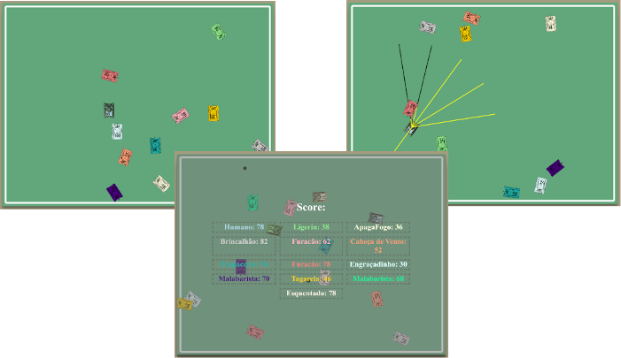

# Tanks Battle with Prolog

Practical Work for the Artificial Intelligence Course.

This project was developed as a practical assignment for the Artificial Intelligence course - 2023.

The HTML/JS/CSS part was built on top of last year's project, [Prolog Racing](https://github.com/jeiks/corrida_em_prolog), which was based on code by *Radu Mariescu-Istodor*, available on his [GitHub](https://github.com/gniziemazity/Self-driving-car).

The objective of this project is to control a tank using Prolog code ([SWI-Prolog](https://www.swi-prolog.org/)) so that it becomes the last one standing. After that, a classroom competition will also take place with all the projects.

<p align="center"></p>

Rules:
* Each tank can fire one bullet per second.
* Each tank starts with 100 health points.
* If it hits the sides of the environment or another tank, it loses 2 health points per second it is in contact/colliding.
* If hit by a bullet, it loses 10 health points.

Keys:
* Arrow keys: tank movement\
  Note: it can only move left or right if it is moving forward or backward.
* Spacebar or Enter: fires a bullet\
  Note: it can only fire one bullet per second.
* "s" key: shows or hides the game scoreboard.

### How to Configure the Game Execution

There are various ways to use this code, choosing to include a tank controlled by the keyboard, none, or several tanks controlled randomly by JavaScript, and none or several tanks controlled by Prolog.

To do this, edit the following lines in the `main.js` file:
```js
const speed=1.5, arenaPadding=10, tankW=50, tankH=30,
      score=100, // tank health
      dummyTanks=10, // number of randomly controlled tanks
      keysTank=true, // modify to have a keyboard-controlled tank
      // names of tanks controlled by Prolog (note: you must adapt controle_tanques.pl when making changes here)
      // the quantity refers to the number of names; if you're lacking creativity, you can repeat names... hehe
      // examples of two:
      //prologTanks=["Ligerin"], // choose the name of your Prolog-controlled tank here
      //prologTanks=["Ligerin", "ApagaFogo"], // if you want to add two Prolog tanks, do it like this
      prologTanks=[], // if you don't want any Prolog tank, do it like this
      showSensors=false, // modify to display the sensors of PROLOG and KEYS tanks
      showSensorsOfDummyTanks=false; // modify to display the sensors of DUMMY tanks
```

The lines are already explained, but to be clearer, the options are:

* **Activate control of a tank with the keyboard (arrow keys and ENTER or Spacebar to fire)**\
  ```js
  keysTank=true; // modify to have a tank controlled by the keyboard
  ```
* **Change the number of tanks controlled by JS (almost-random movements)**
  ```js
  dummyTanks=10; // number of randomly controlled tanks
  ```
* **Do not use any tank controlled by Prolog**
  ```js
  prologTanks=[]; // if you don't want any Prolog tank, do it like this
  ```
* **Use a tank controlled by Prolog**
  * In the `public/main.js` file:
    ```js
    prologTanks=["Ligerin"]; // choose the name of your Prolog-controlled tank here
    //prologTanks=[]; // if you don't want any Prolog tank, do it like this
    ```
  * In the `back/controle_tanques.pl` file:
    ```prolog
    % there must be a file named "tanque0.pl" or "tanque0.pro" with the predicate obter_controles/2
    :- use_module(tanque0, [obter_controles/2 as obter_controles0]).
    % always start with zero (0)
    vez(0, SENSORS, CONTROLS) :- obter_controles0(SENSORS,CONTROLS).
    ```
* **Use two tanks controlled by Prolog**
  * In the `public/main.js` file:
    ```js
    prologTanks=["Ligerin", "ApagaFogo"]; // if you want to add two Prolog tanks, do it like this
    //prologTanks=["Ligerin"]; // choose the name of your Prolog-controlled tank here
    //prologTanks=[]; // if you don't want any Prolog tank, do it like this
    ```
  * In the `back/controle_tanques.pl` file:
    ```prolog
    % there must be a file named "tanque0.pl" or "tanque0.pro" with the predicate obter_controles/2
    :- use_module(tanque0, [obter_controles/2 as obter_controles0]).
    % there must be a file named "tanque1.pl" or "tanque1.pro" with the predicate obter_controles/2
    :- use_module(tanque1, [obter_controles/2 as obter_controles1]).
    % always start with zero (0)
    vez(0, SENSORS, CONTROLS) :- obter_controles0(SENSORS,CONTROLS).
    vez(1, SENSORS, CONTROLS) :- obter_controles1(SENSORS,CONTROLS). 
    ```

Additional:
* Change the speed and health of the tanks:
  ```js
   speed=1.5; // change the maximum speed of the tanks here
   score=100; // change the tank's health here
  ```
* Activate the display of tank sensors:
  ```js
  showSensors=true;
  ```

### How to Run the Server with Prolog

Once you add tanks controlled by Prolog, you must start the server for them to work.

To do this,
1. Install [SWI-Prolog](https://www.swi-prolog.org/). On Debian-based distributions (like Ubuntu), simply run:
   ```sh
   sudo apt install swi-prolog
   ```
2. Download the code:
   ```sh
   git clone https://github.com/jeiks/batalha_tanques
   ```
3. Run the command:
   ```sh
   cd batalha_tanques
   swipl -s src/back/servidor.pl (or open this file in swi-prolog)
   ```
   It will automatically start the server and display the following message:
   ```
   --========================================--

   % Started server at http://localhost:8080/


   --========================================--
   ```
4. Open your browser and go to [http://localhost:8080/](http://localhost:8080/) (I tested everything on Brave Browser, compatible with Google Chrome).
   
The implementation provided here includes two tanks with almost-random movements.

The first one is implemented in the `tanque0.pl` file